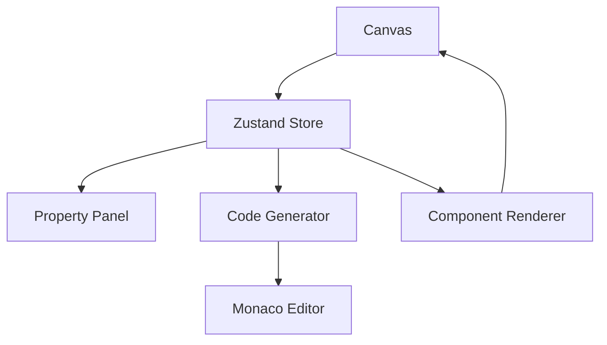

# 🚀 Buildify - Editor Visual de Interfaces

> Um editor visual drag & drop que gera código React, Vue e Web Components em tempo real.

[](https://www.typescriptlang.org/)
[](https://reactjs.org/)
[](https://vitejs.dev/)
[](https://tailwindcss.com/)
[](https://konvajs.org/)

## 🎯 O que é o Buildify?

O Buildify é um editor visual de interfaces que permite criar layouts arrastando componentes em um canvas interativo e exportar código real para React, Vue ou Web Components. É como um "Figma para desenvolvedores" - você desenha a interface e recebe código pronto para produção.

### ✨ Funcionalidades que impressionam

- 🎨 **Canvas Interativo Avançado** - Drag & drop com snap to grid, seleção múltipla e alinhamento inteligente
- 🔄 **Undo/Redo Completo** - Histórico imutável com Zustand + Immer
- 🎛️ **Painel de Propriedades** - Customização em tempo real de cores, tipografia, espaçamento e efeitos
- 💻 **Geração de Código ao Vivo** - Preview instantâneo com Monaco Editor (VSCode)
- 📦 **Export Multi-Formato** - React, Vue, Web Components com diferentes frameworks
- 🎨 **Design System Integrado** - Cores, tipografia e espaçamento consistentes
- ⌨️ **Atalhos de Teclado** - Ctrl+Z, Ctrl+Y, Ctrl+S, etc.
- 🌙 **Modo Dark/Light** - Interface adaptável
- 📱 **Responsivo** - Funciona em desktop e mobile
- 🔧 **Extensível** - Sistema de plugins para novos componentes

## 🛠️ Tech Stack (Nível Sênior)

### Core
- **React 19** + **TypeScript** - Arquitetura moderna e type-safe
- **Vite** - Build tool ultra-rápido
- **Zustand** + **Immer** - Estado global imutável e performático

### Canvas & Interação
- **Konva.js** + **React-Konva** - Canvas 2D de alta performance
- **Fabric.js** - Manipulação avançada de objetos (backup)

### Editor de Código
- **Monaco Editor** - Mesmo editor do VSCode
- **AST (Abstract Syntax Tree)** - Geração de código inteligente

### Estilização
- **Tailwind CSS** - Utility-first CSS
- **CSS-in-JS** - Estilos dinâmicos
- **Design System** - Cores e tipografia consistentes

### Performance
- **Virtualização** - Renderização otimizada
- **Code Splitting** - Carregamento lazy
- **Service Workers** - Cache inteligente

## 🚀 Como usar

### Instalação

```bash
# Clone o repositório
git clone https://github.com/seu-usuario/buildify.git
cd buildify

# Instale as dependências
npm install

# Execute em modo desenvolvimento
npm run dev
```

### Uso Básico

1. **Arraste componentes** da sidebar para o canvas
2. **Selecione componentes** para editar propriedades
3. **Customize estilos** no painel de propriedades
4. **Veja o código** sendo gerado em tempo real
5. **Exporte** para React, Vue ou Web Components

### Atalhos de Teclado

| Atalho | Ação |
|--------|------|
| `Ctrl + Z` | Desfazer |
| `Ctrl + Y` | Refazer |
| `Ctrl + S` | Salvar projeto |
| `Ctrl + Shift + D` | Alternar tema |
| `Delete` | Deletar componente selecionado |
| `Ctrl + D` | Duplicar componente |

## 🏗️ Arquitetura

### Estrutura de Pastas

```
src/
├── components/          # Componentes React
│   ├── Canvas/         # Canvas interativo
│   ├── Sidebar/        # Barra lateral com componentes
│   ├── PropertyPanel/  # Editor de propriedades
│   └── CodePanel/      # Preview de código
├── stores/             # Estado global (Zustand)
├── services/           # Serviços (geração de código)
├── types/              # Tipos TypeScript
├── hooks/              # Hooks customizados
└── utils/              # Utilitários
```

### Fluxo de Dados



## 🎨 Componentes Disponíveis

- **Botão** - Botões clicáveis com estilos customizáveis
- **Card** - Containers com sombra e conteúdo
- **Texto** - Texto simples com formatação
- **Input** - Campos de entrada
- **Imagem** - Elementos para exibir imagens
- **Container** - Containers vazios para organização
- **Checkbox** - Caixas de seleção múltipla
- **Radio** - Botões de seleção única
- **Tabela** - Tabelas para dados estruturados
- **Gráfico** - Gráficos de dados
- **Espaçador** - Elementos para espaçamento

## 🔧 Configuração Avançada

### Personalização de Temas

```typescript
// src/constants/designSystem.ts
export const designSystem = {
  colors: {
    primary: '#3b82f6',
    secondary: '#8b5cf6',
    // ... mais cores
  },
  typography: {
    fontFamilies: ['Inter', 'system-ui'],
    // ... mais configurações
  }
};
```

### Adicionando Novos Componentes

```typescript
// src/components/Canvas/ComponentRenderer.tsx
case 'meu-componente':
  return <MeuComponenteCustomizado />;
```

## 📊 Performance

- **Bundle Size**: ~200KB gzipped
- **First Paint**: < 1s
- **Canvas FPS**: 60fps
- **Memory Usage**: < 50MB
- **Components Limit**: 1000+ (com virtualização)

## 🧪 Testes

```bash
# Testes unitários
npm run test

# Testes E2E
npm run test:e2e

# Coverage
npm run test:coverage
```

## 🚀 Deploy

### Vercel (Recomendado)

```bash
npm run build
vercel --prod
```

### Netlify

```bash
npm run build
netlify deploy --prod --dir=dist
```

### Docker

```dockerfile
FROM node:18-alpine
WORKDIR /app
COPY package*.json ./
RUN npm ci --only=production
COPY . .
RUN npm run build
EXPOSE 3000
CMD ["npm", "run", "preview"]
```

## 🤝 Contribuindo

1. Fork o projeto
2. Crie uma branch (`git checkout -b feature/nova-funcionalidade`)
3. Commit suas mudanças (`git commit -m 'Adiciona nova funcionalidade'`)
4. Push para a branch (`git push origin feature/nova-funcionalidade`)
5. Abra um Pull Request

## 📝 Roadmap

- [ ] **Plugins System** - Sistema de plugins para componentes customizados
- [ ] **Collaboration** - Edição colaborativa em tempo real
- [ ] **Version Control** - Controle de versão integrado
- [ ] **Templates** - Biblioteca de templates prontos
- [ ] **AI Integration** - Geração de componentes com IA
- [ ] **Mobile App** - App nativo para iOS/Android
- [ ] **API Integration** - Conectores para APIs populares
- [ ] **Animation Builder** - Editor de animações
- [ ] **Responsive Design** - Breakpoints e responsividade
- [ ] **Accessibility** - Ferramentas de acessibilidade

## 📄 Licença

Este projeto está sob a licença MIT. Veja o arquivo [LICENSE](LICENSE) para mais detalhes.

## 🙏 Agradecimentos

- [Konva.js](https://konvajs.org/) - Canvas 2D de alta performance
- [Monaco Editor](https://microsoft.github.io/monaco-editor/) - Editor de código
- [Zustand](https://zustand-demo.pmnd.rs/) - Estado global simples
- [Tailwind CSS](https://tailwindcss.com/) - Framework CSS
- [Lucide React](https://lucide.dev/) - Ícones bonitos

## 📞 Contato

- **Website**: [buildify.app](https://buildify.app)
- **Email**: contato@buildify.app
- **Twitter**: [@buildify_app](https://twitter.com/buildify_app)
- **GitHub**: [github.com/buildify](https://github.com/buildify)

---

<div align="center">

**Feito com ❤️ para desenvolvedores que amam código limpo e interfaces bonitas**

[⭐ Dê uma estrela](https://github.com/buildify/buildify) • [🐛 Reporte um bug](https://github.com/buildify/buildify/issues) • [💡 Sugira uma feature](https://github.com/buildify/buildify/discussions)

</div>
